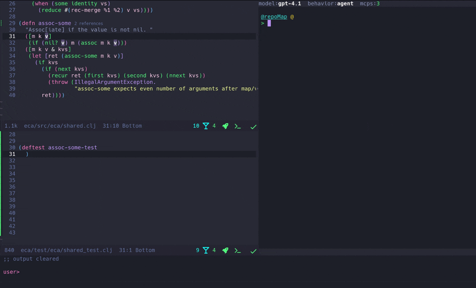

# ECA Emacs

:warning: The project is still alpha and experimental, with bugs and missing features, but being consistenly improved.

[](https://melpa.org/#/eca)
[](./LICENSE)



ECA (Editor Code Assistant) Emacs is an AI-powered pair-programming client for Emacs.
Inspired by lsp-mode’s JSONRPC handling, it connects to an external `eca` server process to provide interactive chat, code suggestions, context management and more.

For more details about ECA, check [ECA server](https://github.com/editor-code-assistant/eca).

## Requirements

- Emacs 28.1 or later

### Optional 

- Custom `eca` server binary, it's automatically downloaded if `eca-custom-command` is `nil`
  - Place it on your `$PATH` or customize `eca-custom-command`
- [whisper.el](https://github.com/natrys/whisper.el/blob/master/whisper.el) for Speech-to-Text support (optional)

## Installation

### Melpa

```
M-x package-install eca
```

### Doom Emacs:

```elisp
(package! eca :recipe (:host github :repo "editor-code-assistant/eca-emacs" :files ("*.el")))
```

## Quickstart

1. Run `M-x eca` to start the eca process and initialize the workspace.
  - eca-emacs will check for `eca-custom-command`;
  - if not set, will check for a `eca` on `$PATH`;
  - if not found, will download `eca` automatically and cache it.
2. The dedicated chat window `<eca-chat>` pops up.
3. Type your prompt after the `> ` and press RET.
4. Attach more context auto completing after the `@`.

## Usage

### Speech-to-Text support

If you have [whisper.el](https://github.com/natrys/whisper.el/blob/master/whisper.el) installed you can use the `eca-chat-talk`
command (or use the `C-t` keybinding) to talk to the Editor Code
Assistant. This will record audio until you press `RET`. Then, the
recorded audio will be transcribed to text and placed into the chat
buffer.

We recommend to use the `small`, it is a good trade-off between
accuracy and transcription speed.

```elisp
(use-package whisper
  :custom
  (whisper-model "small"))
```

### Custom workspaces

Calling `M-x eca` with prefix `C-u` will ask for what workspaces to start the process.

## Tips

### Functions

- `eca-chat-add-context-at-point`: Add the current function or selected lines to chat as context.
- `eca-chat-add-file-context`: Add the current file to chat as context.

### Variables 

- `eca-chat-usage-string-format`: to customize what shows on mode-line for usage like costs and tokens.
- `eca-chat-position-params`: customize the chat window.

### Keybindings

| Feature                         | key                                |
|---------------------------------|------------------------------------|
| Chat: clear                     | <kbd>C-c</kbd> <kbd>C-l</kbd>        |
| Chat: reset                     | <kbd>C-c</kbd> <kbd>C-k</kbd>        |
| Chat: talk                      | <kbd>C-c</kbd> <kbd>C-t</kbd>        |
| Chat: prev prompt history       | <kbd>C-&uarr;</kbd>                |
| Chat: next prompt history       | <kbd>C-&darr;</kbd>                |
| Chat: go to prev block          | <kbd>C-c</kbd> <kbd>&uarr;</kbd>   |
| Chat: go to next block          | <kbd>C-c</kbd> <kbd>&darr;</kbd>   |
| Chat: go to prev user msg       | <kbd>C-c</kbd> <kbd>C-&uarr;</kbd> |
| Chat: go to next user msg       | <kbd>C-c</kbd> <kbd>C-&darr;</kbd> |
| Chat: toggle expandable content | <kbd>C-c</kbd> <kbd>Tab</kbd> |

## Contributing

Contributions are very welcome, please open a issue for discussion or pull request.
